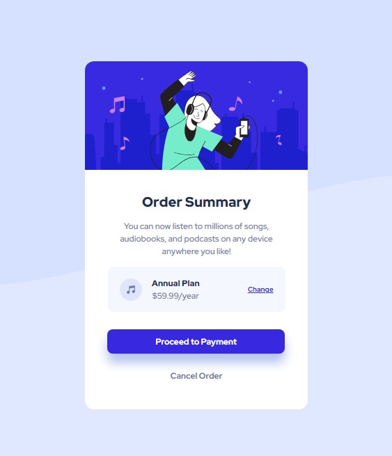

# Frontend Mentor - Order summary card


## Welcome! 👋

Thanks for checking out this front-end coding challenge.

[Frontend Mentor](https://www.frontendmentor.io) challenges help you improve your coding skills by building realistic projects.

# Frontend Mentor - Order summary card solution

This is a solution to the [Order summary card challenge on Frontend Mentor](https://www.frontendmentor.io/challenges/order-summary-component-QlPmajDUj). Frontend Mentor challenges help you improve your coding skills by building realistic projects. 

## Table of contents

- [Overview](#overview)
  - [The challenge](#the-challenge)
  - [Screenshot](#screenshot)
  - [Links](#links)
  - [Built with](#built-with)
  - [What I learned](#what-i-learned)
  - [Continued development](#continued-development)
- [Author](#author)

**Note: Delete this note and update the table of contents based on what sections you keep.**

## Overview
An Order summary basically pulls together all order details into a single, consolidated view.
This project was given by Frontend Mentor.

### The challenge

Users should be able to:

- See hover states for interactive elements

### Screenshot




This is a Screenshot for each Active states

### Links

- Solution URL: [solution URL here](https://github.com/Horlly-moon/Order-summary-component-main)
- Live Site URL: [live site URL here](https://horlly-moon.github.io/Order-summary-component-main/#)

### Built with

- HTML5
- CSS
- Margin
- Padding
- Flexbox


### What I learned
i learnt how to make use of the hover and the active states and also the Flexbox display mode.


```css
.plan {
    width: 255px;
    height: 65px;
    background-color: hsl(225, 100%, 98%);
    margin: 0 auto;
    padding: 17px;
    border-radius: 8px;
    display: flex;
    justify-content: center;
    align-items: center;  
}

a:active {
    color: hsl(245, 84%, 71%);
}

button:active {
    background-color: hsl(245, 84%, 71%);
}
```


### Continued development
During the project i had little bit of a problem making the background responsive, i tried making use of the @media query but it still did not work, or maybe i did not make use of it well. Thanks for taking your time to look through this, Your feedback would be very helpful and Encouraging.


## Author

- Website - [Horlly-moon](https://horlly-moon.github.io/Order-summary-component-main/#)
- Frontend Mentor - [@Horlly-moon](https://www.frontendmentor.io/profile/Horlly-moon)
- Twitter - [@FaithTolu386571](https://www.twitter.com/FaithTolu386571)

